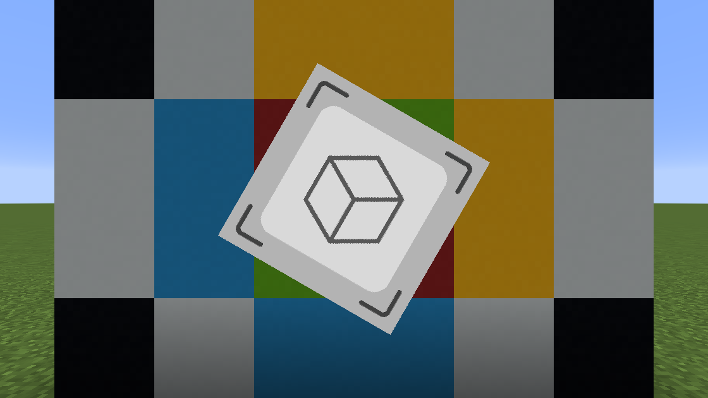
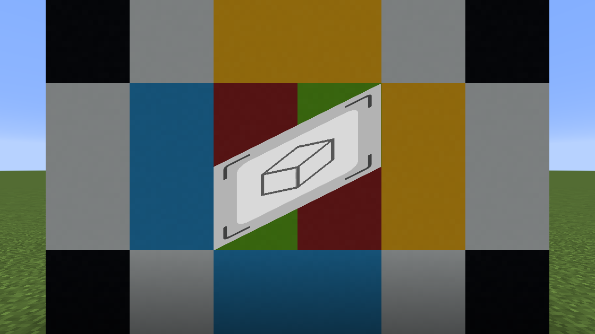

**Download the template resource pack from the [Releases page](https://github.com/onnowhere/VertexEdit/releases).**

----

# Table of Contents
- [VertexEdit](#VertexEdit)
- [Shader Pass Setup](#Shader-Pass-Setup)
- [Tools](#Tools)
    1. [Unscale](#Unscale)
    1. [Crop](#Crop)
    1. [Stretch](#Stretch)
    1. [Scale](#Scale)
    1. [Offset](#Offset)
    1. [Align](#Align)
    1. [Flip](#Flip)
    1. [Rotate](#Rotate)
    1. [Skew](#Skew)
- [License](#License)


# VertexEdit

VertexEdit is a GLSL shader image tool for vanilla Minecraft with various vertex and UV editing features. It provides a vertex shader (`util/vertex_edit`) that can perform various operations to your image. This includes cropping, positioning, scaling, rotating, and more. This shader can either be used within its own shader pass or included as your shader program's vertex shader, allowing you to customize your fragment shader. This can be useful for displaying visuals anywhere on the user's screen. All shaders provided in this resource pack can be copied and reused for your own resource pack shaders.

This template resource pack can be viewed by going into your Video Settings options and setting Graphics to *Fabulous!*

# Shader Pass Setup

An example of the shader pass setup can be found in the file [assets/minecraft/shaders/post/transparency.json](assets/minecraft/shaders/post/transparency.json).

For our shader targets in this example, we take an input buffer called `image_in` of size 256x256 and output buffer `image_out` of default size. If you are using `image_in` to load in a custom image from a file, the values for width and height **must** match your source image resolution. We also have `main` and `swap` which are buffers used for combining our image buffer with Minecraft's render. The remaining buffers are just the default ones used by the `post/transparency.json` Minecraft shader.

```json
    "targets": [
        { "name": "image_in", "width": 256, "height": 256, "bilinear": false },
        "image_out",
        "swap",
        "main",
        "water",
        "translucent",
        "itemEntity",
        "particles",
        "clouds",
        "weather"
    ],
```

The first pass in the example is a direct copy of Minecraft's pass to combine the default passes to create the final image Minecraft renders to the screen. This is used only in the `post/transparency.json` shader. We will be using this as the base image to combine our custom image into. The output will be stored in our buffer called `main`.
```json
        {
            "name": "transparency",
            "intarget": "minecraft:main",
            "outtarget": "main",
            "auxtargets": [ ... ]
        },
```

The second pass loads the image we want to display into the `image_in` buffer target using a custom image loading shader called `util/image`. In this case, we are sourcing a 256x256 image via `"id": "image"`, which loads from the file called `assets/minecraft/textures/effect/image.png`. If you are directly using an image, you will need to use this pass to load it in. You can of course use any target buffer with VertexEdit, not just ones loaded from a custom image. The `intarget` here is just a dummy buffer, as we are only using the buffer from the `ImageSampler` to load an image.
```json
        {
            "name": "util/image",
            "intarget": "image_out",
            "auxtargets": [
                {
                    "name": "ImageSampler",
                    "id": "image",
                    "width": 256,
                    "height": 256,
                    "bilinear": true
                }
            ],
            "outtarget": "image_in"
        },
```

This pass utilizes `util/vertex_edit`, which is where the main work is done. Here we have all the operations we can adjust to perform different edits to your input image from `image_in`. Detail about these operations can be found under the [Tools](#Tools) section. The output **must** be a buffer that matches the size of the buffer you will combine this image with. In this case, `image_out` is the same default size as `main`.
```json
        {
            "name": "util/vertex_edit",
            "intarget": "image_in",
            "outtarget": "image_out",
            "uniforms": [
                { "name": "_Unscale",       "values": [ 0.0 ] },
                { "name": "_CropPixel",     "values": [ 0.0 ] },
                { "name": "_CropResize",    "values": [ 0.0 ] },
                { "name": "_CropRecenter",  "values": [ 0.0 ] },
                { "name": "_Crop",          "values": [ 0.0, 0.0, 0.0, 0.0 ] },
                { "name": "_Stretched",     "values": [ 0.0 ] },
                { "name": "_StretchMin",    "values": [ 0.0, 0.0 ] },
                { "name": "_StretchMax",    "values": [ 0.0, 0.0 ] },
                { "name": "_Scale",         "values": [ 0.0, 0.0 ] },
                { "name": "_OffsetPixel",   "values": [ 0.0 ] },
                { "name": "_Offset",        "values": [ 0.0, 0.0 ] },
                { "name": "_Align",         "values": [ 0.0, 0.0 ] },
                { "name": "_Flip",          "values": [ 0.0, 0.0 ] },
                { "name": "_RotPixel",      "values": [ 0.0 ] },
                { "name": "_RotGlobal",     "values": [ 0.0 ] },
                { "name": "_RotOrigin",     "values": [ 0.0, 0.0 ] },
                { "name": "_RotAngle",      "values": [ 0.0 ] },
                { "name": "_SkewPixel",     "values": [ 0.0 ] },
                { "name": "_Skew",          "values": [ 0.0, 0.0, 0.0, 0.0 ] }
            ]
        }
```

In this pass, we use `util/combine` to combine the source image from `main` with our custom edited image from `image_out` via the `CombineSampler`. We output to another buffer called `swap` so that we can pass it over to the last buffer which finalizes the image.
```json
        {
            "name": "util/combine",
            "intarget": "main",
            "outtarget": "swap",
            "auxtargets": [
                {
                    "name": "CombineSampler",
                    "id": "image_out"
                }
            ]
        },
```

This final pass simply copies the final output from `swap` into Minecraft's main rendering buffer `minecraft:main`. This is a necessary step as without it, there can be issues with Minecraft's rendering when you go in F1 or third person mode. Typically, we want to do this final pass in most of our shaders to avoid these potential issues.
```json
        {
            "name": "blit",
            "intarget": "swap",
            "outtarget": "minecraft:main"
        }
```

# Tools

The following examples use an input image of size 256x256 and an output buffer with size equal to the screen resolution.

## Unscale
- `_Unscale`: Rescale image relative to pixel size instead of to buffer height (accepted values: 0, 1)

If `_Unscale` is set to `0.0`, the image will be scaled to fill the full height of the output buffer.
```json
{ "name": "_Unscale",       "values": [ 0.0 ] }
```


If `_Unscale` is set to `1.0`, the image will be scaled to be one-to-one in pixels on the screen.
```json
{ "name": "_Unscale",       "values": [ 1.0 ] }
```


## Crop

- `_CropPixel`: Crop by pixels instead of ratios (accepted values: 0, 1)
- `_CropResize`: Resize crop to fill original size (accepted values: 0, 1)
- `_CropRecenter`: Recenter image after crop (accepted values: 0, 1)
- `_Crop`: Crop from xy corner to zw corner (set values to 0 to skip)

The first two crop values are the bottom left corner, and the second two crop values are the top right corner. By default, we are cropping using ratios. If all values of `_Crop` are set to `0.0`, the crop is skipped. Here we crop the picture between the two points `(0.5, 0.25)` and `(0.75, 0.75)`.
```json
{ "name": "_Crop",          "values": [ 0.5, 0.25, 0.75, 0.75 ] }
```


If `_CropRecenter` is set to `1.0`, the cropped image will be recentered.
```json
{ "name": "_CropRecenter",  "values": [ 1.0 ] },
{ "name": "_Crop",          "values": [ 0.5, 0.25, 0.75, 0.75 ] }
```


If `_CropResize` is set to `1.0`, the cropped image will be auto-resized to fill the size of the original uncropped frame.
```json
{ "name": "_CropResize",    "values": [ 1.0 ] },
{ "name": "_Crop",          "values": [ 0.5, 0.25, 0.75, 0.75 ] }
```


If `_CropPixel` is set to `1.0`, the values used in `_Crop` will be pixel positions relative to the size of the input buffer.
```json
{ "name": "_CropPixel",     "values": [ 1.0 ] },
{ "name": "_Crop",          "values": [ 64.0, 64.0, 192.0, 192.0 ] }
```


## Stretch
- `_Stretched`: Stretch image horizontally to fill screen (accepted values: 0, 1)
- `_StretchMin`: Stretch image horizontally if screen ratio is larger than x/y ratio (set values to 0 to skip)
- `_StretchMax`: Maximum ratio to stop stretching after (set values to 0 to skip)

If `_Stretched` is set to `1.0`, the image will stretch horizontally to fill the output buffer.
```json
{ "name": "_Stretched",     "values": [ 1.0 ] }
```


If a `_StretchedMin` ratio is defined, when the output buffer ratio exceeds this ratio, it will stretch horizontally, otherwise it will crop the image. If a `_StretchedMax` ratio is defined, when the output buffer ratio is below this ratio, it will stretch horizontally, otherwise it will retain the specified ratio. In this case, we have a minimum stretch width/height ratio of `1.0/1.0` and a maximum stretch width/height ratio of `2.0/1.0`. If `_Stretched` is set to `1.0`, this will also make sure the image is stretched to fill the horizontal width when the output buffer ratio is between the min and max stretch, otherwise it will stretch using the original image size. The image demonstrates four stages (going top to bottom) of progressively increasing the horizontal length of the screen.
```json
{ "name": "_Stretched",     "values": [ 1.0 ] },
{ "name": "_StretchMin",    "values": [ 1.0, 1.0 ] },
{ "name": "_StretchMax",    "values": [ 2.0, 1.0 ] }
```


## Scale
- `_ScalePixel`: Scale by pixels instead of ratios (accepted values: 0, 1)
- `_Scale`: Scale image on x and y axes (set values to 0 to skip)

If `_Scale` is defined, the image will be scaled horizontally by the first value and vertically by the second value relative to the size of the input buffer.
```json
{ "name": "_Scale",         "values": [ 0.25, 0.5 ] }
```


If `_ScalePixel` is set to `1.0`, the image will be scaled by the values of `_Scale` relative to the size of the input buffer in pixels instead of by ratios.
```json
{ "name": "_ScalePixel",    "values": [ 1.0 ] },
{ "name": "_Scale",         "values": [ 128.0, 64.0 ] }
```


## Offset
- `_OffsetPixel`: Offset by pixels instead of ratios (accepted values: 0, 1)
- `_Offset`: Offset image on x and y axes

If `_Offset` is defined, the image will be offset horizontally the first value and vertically by the second value relative to the size of the output buffer.
```json
{ "name": "_Offset",        "values": [ 1.0, -0.5 ] }
```


If `_OffsetPixel` is set to `1.0`, the image will be offset by the values of `_Offset` relative to the size of the output buffer in pixels instead of by ratios.
```json
{ "name": "_OffsetPixel",   "values": [ 1.0 ] },
{ "name": "_Offset",        "values": [ -560.0, 315.0 ] }
```


## Align
- `_Align`: Align to a corner or origin (accepted values: -1, 0, 1)

The values of `_Align` correspond to corners and centerpoints on the output buffer. The first value is horizontal alignment and the second value is vertical alignment. `-1.0` corresponds to the left and bottom side of the buffer, `0.0` corresponds to the center of the buffer, and `1.0` corresponds to the right and top side of the buffer. In this example, we are aligning to the right and bottom of the screen.
```json
{ "name": "_Scale",         "values": [ 0.4, 0.4 ] },
{ "name": "_Align",         "values": [ 1.0, -1.0 ] }
```


In this example, we are aligning to the left and vertical center of the screen.
```json
{ "name": "_Scale",         "values": [ 0.4, 0.4 ] },
{ "name": "_Align",         "values": [ -1.0, 0.0 ] }
```


## Flip
- `_Flip`: Flip horizontally or vertically (accepted values: 0, 1)

Setting the values of `_Flip` to `1.0` determine whether the image will flip horizontally and/or vertically.
```json
{ "name": "_Flip",          "values": [ 0.0, 1.0 ] }
```


## Rotate
- `_RotPixel`: Rotation origin by pixels instead of ratios (accepted values: 0, 1)
- `_RotGlobal`: Rotation on global axis instead of local (accepted values: 0, 1)
- `_RotOrigin`: Rotation origin
- `_RotAngle`: Rotation angle in degrees

The value of `_RotAngle` is in degrees, and will rotate the image about the rotation origin which is default in the center of the image.
```json
{ "name": "_Scale",         "values": [ 0.5, 0.5 ] },
{ "name": "_RotAngle",      "values": [ 30.0 ] }
```


The values of `_RotOrigin` determine the `(x,y)` position of the origin. By default it is relative to the image. Here we rotate about the left top corner.
```json
{ "name": "_Scale",         "values": [ 0.5, 0.5 ] },
{ "name": "_RotOrigin",     "values": [ -1.0, 1.0 ] },
{ "name": "_RotAngle",      "values": [ 30.0 ] }
```


If `_RotGlobal` is set to `1.0`, the values of `_RotOrigin` determine the `(x,y)` position of the origin relative to the output buffer. Here we rotate about the bottom center of the output buffer.
```json
{ "name": "_Scale",         "values": [ 0.5, 0.5 ] },
{ "name": "_RotGlobal",     "values": [ 1.0 ] },
{ "name": "_RotOrigin",     "values": [ 0.0, -1.0 ] },
{ "name": "_RotAngle",      "values": [ 30.0 ] }
```


If `_RotPixel` is set to `1.0`, the values of `_RotOrigin` determine the `(x,y)` position of the origin in pixels. By default it is relative to the image in pixels. Here we rotate about the right top corner of the image.
```json
{ "name": "_Scale",         "values": [ 0.5, 0.5 ] },
{ "name": "_RotPixel",      "values": [ 1.0 ] },
{ "name": "_RotOrigin",     "values": [ 128.0, 128.0 ] },
{ "name": "_RotAngle",      "values": [ 30.0 ] }
```


If `_RotPixel` and `_RotGlobal` are set to `1.0`, the values of `_RotOrigin` determine the `(x,y)` position of the origin in pixels relative to the output buffer in pixels. Here we rotate about the right center of the output buffer.
```json
{ "name": "_Scale",         "values": [ 0.5, 0.5 ] },
{ "name": "_RotPixel",      "values": [ 1.0 ] },
{ "name": "_RotGlobal",     "values": [ 1.0 ] },
{ "name": "_RotOrigin",     "values": [ 560.0, 0.0 ] },
{ "name": "_RotAngle",      "values": [ 30.0 ] }
```


## Skew
- `_SkewPixel`: Skew by pixels instead of ratios (accepted values: 0, 1)
- `_Skew`: Skew top corners and their opposite corner by values xy and zw (set values to 0 to skip)

The values of `_Skew` correspond to the offsets of the top two corners of the image as well as the mirrored offset of the opposite corner. The first two values are the offset of the left top corner, which will be mirrored by the right bottom corner. The second two values are the offset of the right top corner, which will be mirrored by the left bottom corner. In this example, we offset the left top corner by `(-1.0, 0.5)`.
```json
{ "name": "_Scale",         "values": [ 0.5, 0.5 ] },
{ "name": "_Skew",          "values": [ -1.0, 0.5, 0.0, 0.0 ] }
```


In this example, we offset the right top corner by `(-0.25, -0.5)`.
```json
{ "name": "_Scale",         "values": [ 0.5, 0.5 ] },
{ "name": "_Skew",          "values": [ 0.0, 0.0, -0.25, -0.5 ] }
```


If `_SkewPixel` is set to `1.0`, the offset will be relative to the original image in pixels instead of by ratio. In this case we are offsetting the left top corner by `(0.0, -128.0)` in pixels.
```json
{ "name": "_Scale",         "values": [ 0.5, 0.5 ] },
{ "name": "_SkewPixel",     "values": [ 1.0 ] },
{ "name": "_Skew",          "values": [ 0.0, -128.0, 0.0, 0.0 ] }
```


# License

This project is made available under the [Creative Commons CC0 Public Domain license](LICENSE).